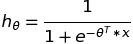

### Logistic equation

### data
Data is generated, using the function itself for testing purposes(Matlab was used) 
The parameters for each data set will be specified below for you to check: 
training_data_1d_\* and test_data_1d_\*: 0, 0.5 
training_data_2d_\* and test_data_2d_\*: 0, -0.9, 1.2 
training_data_5d_\* and test_data_5d_\*: 0, -0.1488, -0.8830, 1.1990, 0.7878, 1.1475 
note: first term is intercept term, followed by parameters for x1, x2, x3....
